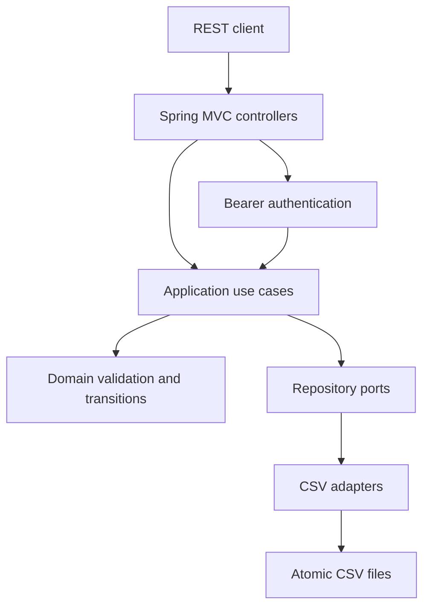

# Account and Friends MVP Design

**Spec**: `.specs/features/account-and-friends-mvp/spec.md`
**Status**: Approved

## Architecture Overview

GiftMe will use a small hexagonal architecture. HTTP controllers depend on application use cases, use cases depend on domain models and repository ports, and CSV adapters implement those ports. Spring Security owns request authentication while the application owns account and profile rules.



## Code Reuse Analysis

### Existing Components to Leverage

| Component | Location | How to Use |
| --- | --- | --- |
| Existing application code | None | The cloned GiftMe repository is empty, so no prior implementation is reused. |
| Spring Boot conventions | Maven/Spring ecosystem | Use standard dependency injection, MVC validation, and security integration. |

### Integration Points

| System | Integration Method |
| --- | --- |
| HTTP client | JSON REST endpoints under `/api`. |
| Authentication | Bearer token filter and authenticated principal. |
| Initial persistence | Repository ports backed by CSV files under a configurable data directory. |
| Future relational database | Replace CSV adapter implementations without changing use cases or controllers. |

## Components

### Domain Models

- **Purpose**: Represent accounts, profiles, custom sizes, photos, and friendship state without Spring or CSV concerns.
- **Location**: `src/main/java/com/ftabah/giftme/domain/`
- **Interfaces**: Immutable or validation-safe records/classes for `Account`, `Profile`, `CustomSize`, `ProfilePhoto`, and `FriendshipRequest`.
- **Dependencies**: Java standard library only.
- **Reuses**: None; this is the new domain boundary.

### Application Use Cases

- **Purpose**: Coordinate registration, login, profile updates, search, profile lookup, and friendship transitions.
- **Location**: `src/main/java/com/ftabah/giftme/application/`
- **Interfaces**:
  - `register(email, rawPassword)` returns an authenticated session.
  - `login(email, rawPassword)` returns an authenticated session.
  - `updateOwnProfile(userId, profileInput)` validates and saves the profile.
  - `searchProfiles(query, requesterId)` returns public profile summaries.
  - `getProfile(profileId, requesterId)` returns a public profile view.
  - `sendFriendshipRequest(requesterId, recipientId)` creates a pending request.
  - `decideFriendshipRequest(recipientId, requestId, decision)` applies `ACCEPTED` or `REJECTED`.
  - `listFriendshipRequests(userId)` returns relevant request views.
- **Dependencies**: Domain models, repository ports, password hashing, token service, and transaction boundary.
- **Reuses**: None; it is the stable business boundary for later adapters.

### Repository Ports

- **Purpose**: Isolate persistence and make each operation testable without filesystem coupling.
- **Location**: `src/main/java/com/ftabah/giftme/application/port/`
- **Interfaces**:
  - `AccountRepository`: find by id/email, save, and list matching accounts.
  - `ProfileRepository`: find and replace profile by account id.
  - `FriendshipRepository`: find pair/request, save, update state, and list relevant requests.
- **Dependencies**: Domain models only.
- **Reuses**: No framework repository interface is required for CSV.

### CSV Persistence Adapters

- **Purpose**: Serialize repository records to CSV and recover them safely on startup and operation.
- **Location**: `src/main/java/com/ftabah/giftme/adapter/storage/csv/`
- **Interfaces**: Implement the repository ports and a shared CSV codec/file writer.
- **Dependencies**: Java NIO, a CSV parser library, configured data directory.
- **Reuses**: The port contracts; no use case knows CSV column order.
- **Files**: `accounts.csv`, `profiles.csv`, `custom_sizes.csv`, `friendships.csv`.
- **Photo representation**: `profiles.csv` stores Base64 photo bytes and `image/png` media type in escaped CSV fields.
- **Write strategy**: Write a complete replacement file to a temporary sibling, flush it, then atomically move it over the target when the filesystem supports that operation.

### REST Controllers and DTOs

- **Purpose**: Expose stable JSON contracts and translate HTTP concerns into application inputs.
- **Location**: `src/main/java/com/ftabah/giftme/adapter/web/`
- **Interfaces**:
  - `POST /api/auth/register`
  - `POST /api/auth/login`
  - `GET /api/profiles/me`
  - `PUT /api/profiles/me`
  - `GET /api/profiles/search?q=...`
  - `GET /api/profiles/{userId}`
  - `POST /api/friendships/requests`
  - `GET /api/friendships/requests`
  - `POST /api/friendships/requests/{requestId}/decision`
- **Dependencies**: Spring MVC, validation, application use cases.
- **Reuses**: Standard Spring error handling via one JSON error envelope.

### Authentication Adapter

- **Purpose**: Hash passwords, create bearer sessions, and populate the authenticated user id for each request.
- **Location**: `src/main/java/com/ftabah/giftme/adapter/security/`
- **Interfaces**: `PasswordHasher`, `TokenService`, and Spring Security filter/configuration.
- **Dependencies**: Spring Security and a signed token implementation.
- **Reuses**: The account repository port; raw passwords never cross into persistence.

## Data Models

### Account

```text
id: UUID
email: normalized string, unique
passwordHash: string
createdAt: instant
```

### Profile

```text
userId: UUID
name: non-blank string
age: integer 0..150
height: non-blank string
shoeSize: non-blank string
waistSize: non-blank string
shirtSize: non-blank string
customSizes: unique case-insensitive names with non-blank values
photo: optional PNG bytes, max 2 MiB decoded
```

### FriendshipRequest

```text
id: UUID
requesterId: UUID
recipientId: UUID
status: PENDING | ACCEPTED | REJECTED
createdAt: instant
updatedAt: instant
```

**Relationships**: An account owns one profile. A friendship request references two accounts. The request direction is retained even after acceptance.

## Error Handling Strategy

| Error Scenario | Handling | User Impact |
| --- | --- | --- |
| Missing or invalid bearer token | Return HTTP 401 with `code=UNAUTHENTICATED`. | Client returns to login. |
| Invalid input | Return HTTP 400 with field-level errors and leave prior data unchanged. | Client can correct the form. |
| Duplicate email or friendship request | Return HTTP 409 for duplicate account; HTTP 400 for invalid friendship command as specified. | Client displays a deterministic conflict. |
| Non-recipient friendship decision | Return HTTP 403 and preserve state. | Client cannot alter another user's request. |
| Unknown profile | Return HTTP 404 without exposing storage details. | Client shows that the profile is unavailable. |
| Malformed CSV or failed atomic write | Fail the operation, log a diagnostic without secrets, and preserve the previous loaded state. | Client sees a generic HTTP 500 error; operators get a local diagnostic. |

## Risks & Concerns

| Concern | Location | Impact | Mitigation |
| --- | --- | --- | --- |
| CSV is not suitable for concurrent writers or high volume | CSV adapter | Lost updates or slow searches as data grows. | Explicitly support one application instance, isolate ports, and document the future SQL migration. |
| Base64 photos increase CSV size and memory use | Profile storage | A few large photos can make reads expensive. | Enforce 2 MiB decoded limit, validate before writes, and keep photo handling behind the profile port. |
| Search reveals profile data before friendship | Profile API | Users may expect stronger privacy than the selected MVP behavior. | Keep this decision explicit in the spec and revisit before production; do not add hidden access rules. |
| Token invalidation/revocation is not defined | Security adapter | A stolen token remains valid until expiry. | Use short token expiry for MVP and defer revocation/password reset to a security follow-up. |
| Empty repository has no established test/build conventions | Project root | Incorrect tooling choices can delay implementation. | Establish Maven build, unit tests, controller integration tests, and a deterministic build gate in the first foundation task. |

## Tech Decisions

| Decision | Choice | Rationale |
| --- | --- | --- |
| Architecture | Hexagonal light | Keeps business rules independent from CSV and Spring web details. |
| API style | JSON REST | Fits a login/profile UI and supports a future web or mobile client. |
| Persistence boundary | Repository ports plus CSV adapters | Makes the explicit temporary storage choice replaceable. |
| Photo transport | Multipart upload or Base64 DTO, normalized internally to bytes | Supports a browser form while making the 2 MiB validation unambiguous. |
| Session transport | Signed bearer token | Stateless API contract with no session table in the initial CSV set. |

## Design Approval

The architecture approach and product decisions were approved by the user on 2026-09-07. Implementation tasks must preserve the requirement IDs and test every acceptance criterion in scope.